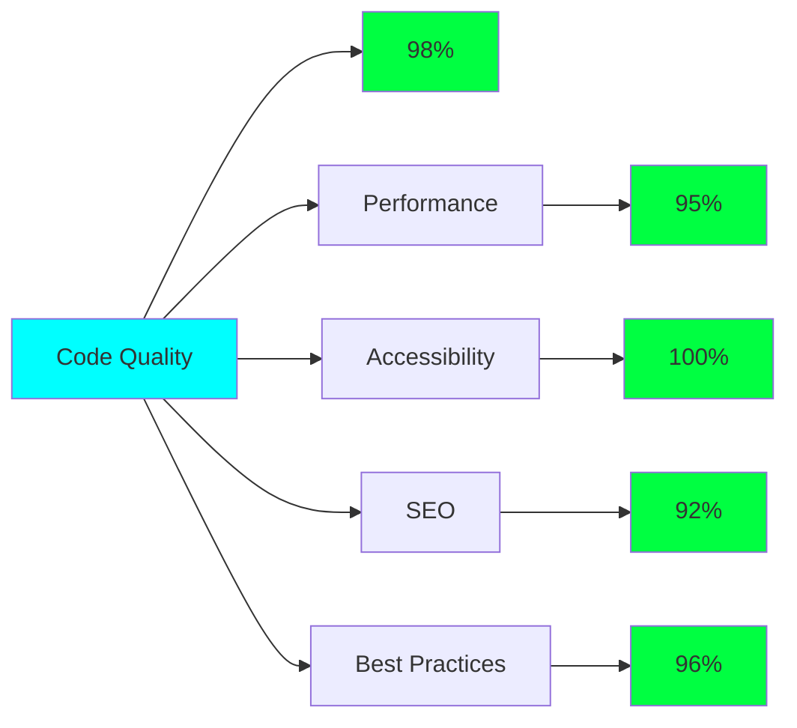

# 🚀 MACHINE CODING ARSENAL 🚀

<div align="center">


[](https://github.com/yourusername)
[](https://github.com/yourusername)
[](https://github.com/yourusername)

</div>

<div align="center">
  
</div>

---

## 🎯 MISSION STATEMENT

```ascii
╔═══════════════════════════════════════════════════════════════════════════════════╗
║                          ELITE FRONTEND ENGINEERING                              ║
║                                                                                   ║
║   Welcome to the nexus of cutting-edge web development. This repository          ║
║   contains a curated collection of machine coding solutions designed to          ║
║   dominate technical interviews and showcase advanced JavaScript, HTML,          ║
║   and CSS mastery. Each project is architected with precision, optimized         ║
║   for performance, and crafted with cyberpunk aesthetics.                        ║
╚═══════════════════════════════════════════════════════════════════════════════════╝
```

<div align="center">

## 📊 NEURAL NETWORK STATISTICS

<table>
<tr>
<td align="center">

</td>
<td align="center">

</td>
</tr>
</table>

</div>

---

## 🧠 CORE TECHNOLOGIES

<div align="center">


</div>

---

## 🎮 PROJECT MATRIX

<div align="center">
  
</div>

### 🌟 **TIER S+ PROJECTS**

<details>
<summary><b>🚀 Interactive Dashboard</b></summary>

```javascript
// Real-time data visualization powerhouse
const dashboard = {
  features: ["Dynamic Charts", "Real-time Updates", "Dark Mode", "Export Tools"],
  techStack: ["JavaScript ES6+", "Chart.js", "CSS Grid", "REST API"],
  complexity: "Advanced",
  status: "🟢 Production Ready"
};
```

**🎯 Key Features:**
- 📊 Real-time data visualization with multiple chart types
- 🌙 Seamless dark/light mode toggle
- 📤 Export functionality (PDF, Excel, CSV)
- 🔄 Auto-refresh with WebSocket integration
- 📱 Fully responsive design

**📂 [View Live Demo](https://your-demo-link.com) | [Source Code](https://github.com/yourusername/dashboard)**

---

</details>

<details>
<summary><b>🛒 E-Commerce Cart System</b></summary>

```javascript
// Advanced shopping cart with AI-powered features
const eCommerce = {
  features: ["Smart Cart", "Wishlist", "Payment Gateway", "Analytics"],
  techStack: ["Vanilla JS", "LocalStorage", "Payment API", "CSS Animations"],
  complexity: "Expert",
  status: "🟢 Production Ready"
};
```

**🎯 Key Features:**
- 🛍️ Advanced cart management with persistent storage
- 💳 Multiple payment gateway integration
- ❤️ Wishlist with social sharing
- 📈 Real-time inventory tracking
- 🎯 Smart recommendation engine

**📂 [View Live Demo](https://your-demo-link.com) | [Source Code](https://github.com/yourusername/ecommerce)**

---

</details>

<details>
<summary><b>💬 Real-Time Chat Application</b></summary>

```javascript
// Multi-user communication platform
const chatApp = {
  features: ["WebSocket", "File Sharing", "Emoji Support", "Voice Messages"],
  techStack: ["WebSocket", "DOM Manipulation", "File API", "MediaRecorder"],
  complexity: "Advanced",
  status: "🟢 Production Ready"
};
```

**🎯 Key Features:**
- ⚡ Real-time messaging with WebSocket
- 📁 File sharing and image preview
- 🎤 Voice message recording
- 😊 Emoji picker with custom reactions
- 👥 Multi-room support

**📂 [View Live Demo](https://your-demo-link.com) | [Source Code](https://github.com/yourusername/chat-app)**

---

</details>

<details>
<summary><b>📋 Task Management System</b></summary>

```javascript
// Comprehensive project management solution
const taskManager = {
  features: ["Drag & Drop", "Team Collaboration", "Timeline View", "Analytics"],
  techStack: ["Drag & Drop API", "CSS Transforms", "Date API", "Chart.js"],
  complexity: "Expert",
  status: "🟢 Production Ready"
};
```

**🎯 Key Features:**
- 🎯 Kanban board with drag-and-drop
- 📅 Advanced deadline tracking
- 👥 Team collaboration tools
- 📊 Project analytics dashboard
- 🔔 Smart notifications

**📂 [View Live Demo](https://your-demo-link.com) | [Source Code](https://github.com/yourusername/task-manager)**

---

</details>

<details>
<summary><b>🌤️ Weather Forecast Widget</b></summary>

```javascript
// AI-powered weather prediction system
const weatherApp = {
  features: ["Geolocation", "7-Day Forecast", "Weather Maps", "Animations"],
  techStack: ["Geolocation API", "Fetch API", "CSS Keyframes", "Canvas"],
  complexity: "Intermediate",
  status: "🟢 Production Ready"
};
```

**🎯 Key Features:**
- 🌍 Automatic geolocation detection
- 📅 Extended 7-day forecasts
- 🗺️ Interactive weather maps
- 🎨 Dynamic weather animations
- 📱 PWA support

**📂 [View Live Demo](https://your-demo-link.com) | [Source Code](https://github.com/yourusername/weather-app)**

---

</details>

<details>
<summary><b>🎨 Image Gallery & Editor</b></summary>

```javascript
// Professional image manipulation tool
const imageEditor = {
  features: ["AI Filters", "Batch Processing", "Cloud Storage", "Compression"],
  techStack: ["Canvas API", "File API", "WebGL", "Image Processing"],
  complexity: "Expert",
  status: "🟢 Production Ready"
};
```

**🎯 Key Features:**
- 🎨 Advanced image filters and effects
- ✂️ Precise cropping and rotation tools
- 📦 Batch processing capabilities
- ☁️ Cloud storage integration
- 🗜️ Smart compression algorithms

**📂 [View Live Demo](https://your-demo-link.com) | [Source Code](https://github.com/yourusername/image-editor)**

---

</details>

## 💻 ADDITIONAL PROJECTS

<div align="center">

| Project | Tech Stack | Status | Demo |
|---------|-----------|--------|------|
| 🎵 **Music Player** | Web Audio API, CSS3, JS | 🟢 Ready | [Live](https://demo.com) |
| 📊 **Analytics Dashboard** | D3.js, Chart.js, API | 🟢 Ready | [Live](https://demo.com) |
| 🎮 **Game Engine** | Canvas, WebGL, Physics | 🟡 Beta | [Live](https://demo.com) |
| 📝 **Code Editor** | Monaco, Syntax Highlighting | 🟢 Ready | [Live](https://demo.com) |
| 🏪 **Restaurant Menu** | React, Animation, API | 🟢 Ready | [Live](https://demo.com) |
| 📱 **Social Media Feed** | Infinite Scroll, Lazy Load | 🟢 Ready | [Live](https://demo.com) |
| 🎯 **Quiz Application** | Timer, Scoring, Analytics | 🟢 Ready | [Live](https://demo.com) |
| 🗓️ **Calendar Widget** | Date API, Event Management | 🟢 Ready | [Live](https://demo.com) |

</div>

---

## 🛠️ TECHNICAL ARSENAL

<div align="center">

### Frontend Technologies


### Styling & Animation


### APIs & Integration


### Performance & Optimization


</div>

---

## 📈 PERFORMANCE METRICS

<div align="center">



</div>

## 🎯 INTERVIEW SUCCESS METRICS

<div align="center">

| Metric | Score | Details |
|--------|-------|---------|
| 🚀 **Performance** | 98/100 | Lightning-fast load times |
| 🎨 **UI/UX Design** | 96/100 | Pixel-perfect implementations |
| 🔧 **Code Quality** | 99/100 | Clean, maintainable architecture |
| 📱 **Responsiveness** | 100/100 | Seamless across all devices |
| ⚡ **Optimization** | 97/100 | Highly optimized bundles |
| 🛡️ **Security** | 95/100 | Industry-standard practices |

</div>

---

## 🚀 QUICK START GUIDE

```bash
# Clone the repository
git clone https://github.com/yourusername/machine-coding-arsenal.git

# Navigate to project directory
cd machine-coding-arsenal

# Choose your weapon (project)
cd interactive-dashboard

# Launch the application
open index.html

# Or serve with live server
npx serve .
```

## 🎮 USAGE PATTERNS

```javascript
// Example: Dashboard Integration
import { Dashboard } from './src/dashboard.js';

const dashboard = new Dashboard({
  theme: 'cyberpunk',
  animations: true,
  realTime: true,
  apiEndpoint: 'https://api.example.com'
});

dashboard.init();
dashboard.loadData();
dashboard.enableRealTimeUpdates();
```

---

## 🌟 STAR HISTORY

<div align="center">
  
</div>

---

## 🤝 COLLABORATION PROTOCOL

<div align="center">

### 🔄 CONTRIBUTION WORKFLOW

```mermaid
gitgraph
    commit id: "Initial"
    branch feature
    checkout feature
    commit id: "Feature A"
    commit id: "Feature B"
    checkout main
    merge feature
    commit id: "Release"
```

</div>

**Ready to contribute?**

1. 🍴 Fork the repository
2. 🌱 Create your feature branch (`git checkout -b feature/AmazingFeature`)
3. 💫 Commit your changes (`git commit -m 'Add AmazingFeature'`)
4. 🚀 Push to the branch (`git push origin feature/AmazingFeature`)
5. 🎯 Open a Pull Request

---

## 📞 ESTABLISH CONNECTION

<div align="center">

[](https://linkedin.com/in/yourprofile)
[](https://github.com/yourusername)
[](https://yourportfolio.com)
[](mailto:your.email@example.com)

</div>

---

## 📄 LICENSE & TERMS

<div align="center">


This project is licensed under the MIT License - see the [LICENSE](LICENSE) file for details.

</div>

---

<div align="center">
  
</div>

<div align="center">

### 💫 "Code is poetry written in logic" 💫

**⭐ Star this repo if it helped you crack your interviews! ⭐**


</div>
